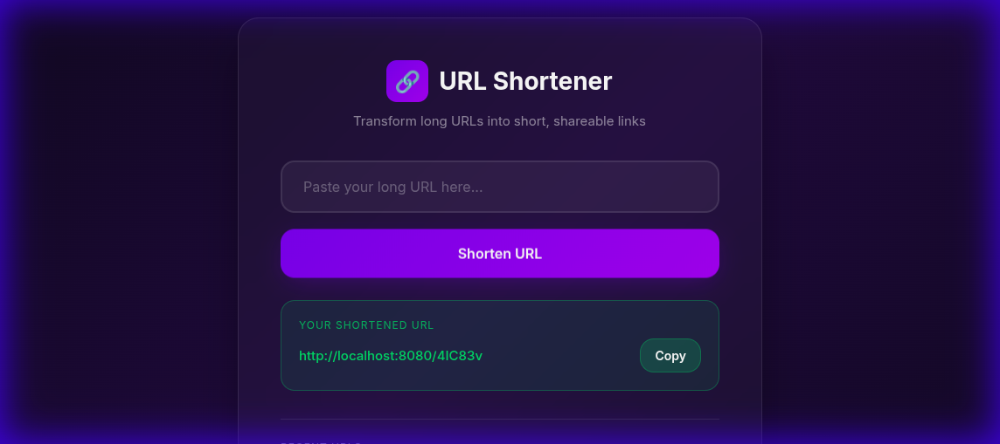
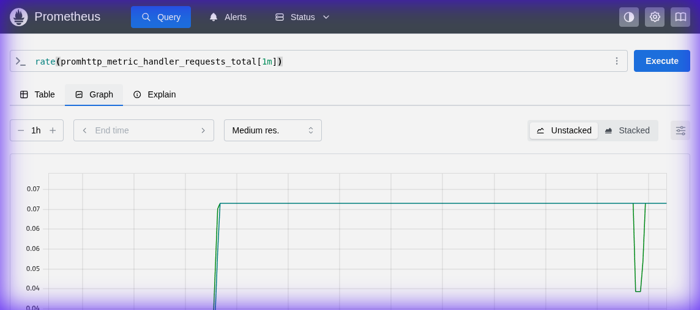
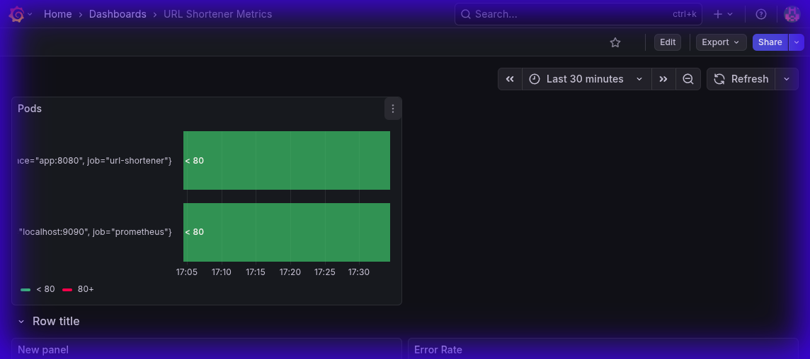

# 🔗 URL Shortener - DevOps Project

A production-ready URL shortener service built with Go, featuring Redis persistence, Prometheus monitoring, Grafana dashboards, Docker Compose, and Kubernetes support.



## 🚀 Features

- **URL Shortening**: Convert long URLs into short, shareable codes
- **Modern Web UI**: Beautiful glassmorphism interface with copy & history
- **Redis Storage**: Persistent URL storage with Redis
- **Prometheus Metrics**: Built-in metrics for monitoring
- **Grafana Dashboards**: Visualize application performance
- **Health Checks**: Kubernetes-ready health endpoints
- **Graceful Shutdown**: Clean server shutdown handling
- **Docker Compose**: One-command local development setup
- **Kubernetes Ready**: Full K8s manifests included

## 📁 Project Structure

```
URL_Shortener_DevOps/
├── cmd/server/main.go           # Application entry point
├── internal/
│   ├── handler/                 # HTTP handlers
│   ├── metrics/                 # Prometheus metrics & middleware
│   └── store/                   # Storage implementations
├── ui/index.html                # Web UI
├── k8s/                         # Kubernetes manifests
├── grafana/                     # Grafana provisioning
├── docs/                        # Screenshots & documentation
├── docker-compose.yml           # Full stack setup
├── Dockerfile                   # Multi-stage build
└── prometheus.yml               # Prometheus config
```

## 🛠️ Quick Start

### Prerequisites
- Docker & Docker Compose
- Go 1.23+ (for local development)

### Run with Docker Compose

```bash
# Start all services
sudo docker compose up -d

# Check status
sudo docker ps
```

### Access Services

| Service | URL | Credentials |
|---------|-----|-------------|
| **URL Shortener API** | http://localhost:8080 | - |
| **Web UI** | Open `ui/index.html` | - |
| **Prometheus** | http://localhost:9090 | - |
| **Grafana** | http://localhost:3000 | admin / admin |

## 🌐 Web UI

Open `ui/index.html` in your browser to use the URL shortener with a beautiful interface:


**Features:**
- Paste and shorten URLs with one click
- Copy shortened URLs to clipboard
- View recent URL history (stored locally)

## 📡 API Endpoints

### Create Short URL
```bash
curl -X POST http://localhost:8080/shorten \
  -H "Content-Type: application/json" \
  -d '{"url": "https://example.com/very-long-url"}'
```

**Response:**
```json
{"ShortURL": "http://localhost:8080/abc123"}
```

### Redirect to Original URL
```bash
curl -L http://localhost:8080/abc123
```

### Health Check
```bash
curl http://localhost:8080/health
# Returns: OK
```

### Prometheus Metrics
```bash
curl http://localhost:8080/metrics
```

## 📊 Monitoring

### Prometheus



**Available Metrics:**
| Metric | Type | Description |
|--------|------|-------------|
| `url_shortener_shorten_requests_total` | Counter | Total shorten requests |
| `http_request_duration_seconds` | Histogram | Request latency |
| `promhttp_metric_handler_requests_total` | Counter | Metrics endpoint requests |

**Useful PromQL queries:**
```promql
# Request rate per second
rate(promhttp_metric_handler_requests_total[1m])

# 95th percentile latency
histogram_quantile(0.95, rate(http_request_duration_seconds_bucket[5m]))

# Average response time
rate(http_request_duration_seconds_sum[5m]) / rate(http_request_duration_seconds_count[5m])
```

### Grafana Dashboard



**Dashboard includes:**
- HTTP Request Rate
- Response Latency (p50, p95)
- Error Rate
- Pod/Service Status

## 🐳 Docker Commands

```bash
# Start all services
sudo docker compose up -d

# View logs
sudo docker compose logs -f app

# Stop all services
sudo docker compose down

# Rebuild after code changes
sudo docker compose up --build -d
```

## ☸️ Kubernetes Deployment

```bash
# Apply all manifests
kubectl apply -f k8s/

# Check deployments
kubectl get pods,svc

# Access via port-forward
kubectl port-forward svc/url-shortener 8080:80
```

## 🔧 Environment Variables

| Variable | Default | Description |
|----------|---------|-------------|
| `PORT` | 8080 | Server port |
| `REDIS_ADDR` | redis:6379 | Redis connection address |

## 🏗️ Architecture

```
┌─────────────┐     ┌─────────────┐     ┌─────────────┐
│   Client    │────▶│ URL Shortener│────▶│    Redis    │
│   (UI)      │     │   (Go App)   │     │  (Storage)  │
└─────────────┘     └──────┬───────┘     └─────────────┘
                           │ /metrics
                    ┌──────▼───────┐
                    │  Prometheus  │
                    └──────┬───────┘
                           │
                    ┌──────▼───────┐
                    │   Grafana    │
                    └──────────────┘
```

## 📚 Learning Resources

See [LEARNINGS.md](LEARNINGS.md) for:
- Common errors and solutions
- PromQL query examples
- Docker troubleshooting
- Go best practices

## 📝 License

MIT License

## 👤 Author

**Kunal Siyag**
- GitHub: [@KunalSiyag](https://github.com/KunalSiyag)
