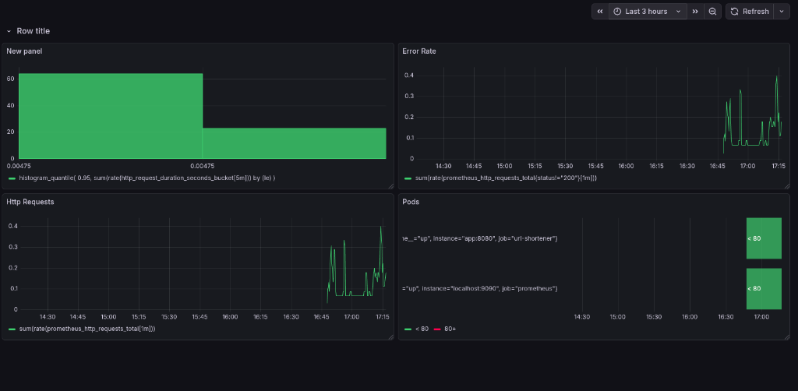
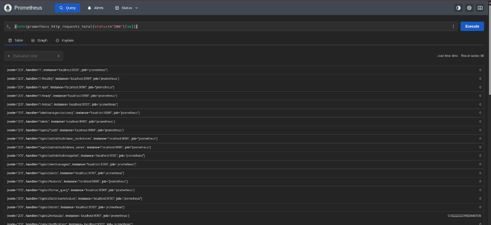

# 🔗 URL Shortener - DevOps Project

A production-ready URL shortener service built with Go, featuring Redis persistence, Prometheus monitoring, Grafana dashboards, and full containerization with Docker Compose and Kubernetes support.

## 🚀 Features

- **URL Shortening**: Convert long URLs into short, shareable codes
- **Redis Storage**: Persistent URL storage with Redis
- **Prometheus Metrics**: Built-in metrics for monitoring request rates, latency, and errors
- **Grafana Dashboards**: Visualize application performance
- **Health Checks**: Kubernetes-ready health endpoints
- **Graceful Shutdown**: Clean server shutdown handling
- **Docker Compose**: One-command local development setup
- **Kubernetes Ready**: Full K8s manifests included

## 📁 Project Structure

```
URL_Shortener_DevOps/
├── cmd/
│   └── server/
│       └── main.go              # Application entry point
├── internal/
│   ├── handler/
│   │   ├── url.go               # HTTP handlers for shorten/redirect
│   │   └── encoding.go          # Short code generation
│   ├── metrics/
│   │   ├── metrics.go           # Prometheus metrics definitions
│   │   └── middleware.go        # HTTP metrics middleware
│   └── store/
│       ├── store.go             # Store interface
│       ├── memory.go            # In-memory store implementation
│       └── redis.go             # Redis store implementation
├── k8s/                         # Kubernetes manifests
│   ├── deployment.yaml
│   ├── service.yaml
│   ├── ingress.yaml
│   ├── prometheus-deployment.yaml
│   ├── prometheus-config.yaml
│   ├── prometheus-service.yaml
│   ├── grafana-deployment.yaml
│   └── grafana-service.yaml
├── grafana/
│   └── provisioning/
│       └── datasources/
│           └── prometheus.yml   # Auto-configure Prometheus datasource
├── docs/                        # Screenshots and documentation
├── docker-compose.yml           # Full stack: app + redis + prometheus + grafana
├── Dockerfile                   # Multi-stage Docker build
├── prometheus.yml               # Prometheus scrape configuration
├── go.mod
└── go.sum
```

## 🛠️ Quick Start

### Prerequisites
- Docker & Docker Compose
- Go 1.23+ (for local development)

### Run with Docker Compose

```bash
# Start all services
sudo docker compose up -d

# Check status
sudo docker ps
```

### Access Services

| Service | URL | Credentials |
|---------|-----|-------------|
| URL Shortener | http://localhost:8080 | - |
| Prometheus | http://localhost:9090 | - |
| Grafana | http://localhost:3000 | admin / admin |

## 📡 API Endpoints

### Create Short URL
```bash
curl -X POST http://localhost:8080/shorten \
  -H "Content-Type: application/json" \
  -d '{"url": "https://example.com/very-long-url"}'
```

**Response:**
```json
{"ShortURL": "http://localhost:8080/abc123"}
```

### Redirect to Original URL
```bash
curl -L http://localhost:8080/abc123
```

### Health Check
```bash
curl http://localhost:8080/health
# Returns: OK
```

### Prometheus Metrics
```bash
curl http://localhost:8080/metrics
```

## 📊 Monitoring

### Available Metrics

| Metric | Type | Description |
|--------|------|-------------|
| `url_shortener_shorten_requests_total` | Counter | Total shorten requests by status |
| `http_request_duration_seconds` | Histogram | Request latency by method/path |
| `promhttp_metric_handler_requests_total` | Counter | Metrics endpoint requests |

### Grafana Dashboard



### Prometheus Queries



**Useful PromQL queries:**

```promql
# Request rate per second
rate(promhttp_metric_handler_requests_total[1m])

# 95th percentile latency
histogram_quantile(0.95, rate(http_request_duration_seconds_bucket[5m]))

# Average response time
rate(http_request_duration_seconds_sum[5m]) / rate(http_request_duration_seconds_count[5m])

# Error rate (status != 200)
sum(rate(prometheus_http_requests_total{status!="200"}[1m]))
```

## 🐳 Docker Commands

```bash
# Start all services
sudo docker compose up -d

# View logs
sudo docker compose logs -f app

# Stop all services
sudo docker compose down

# Rebuild after code changes
sudo docker compose up --build -d

# Check running containers
sudo docker ps
```

## ☸️ Kubernetes Deployment

```bash
# Apply all manifests
kubectl apply -f k8s/

# Check deployments
kubectl get pods,svc

# Access via port-forward
kubectl port-forward svc/url-shortener 8080:80
```

## 🔧 Environment Variables

| Variable | Default | Description |
|----------|---------|-------------|
| `PORT` | 8080 | Server port |
| `REDIS_ADDR` | redis:6379 | Redis connection address |

## 🏗️ Architecture

```
┌─────────────┐     ┌─────────────┐     ┌─────────────┐
│   Client    │────▶│ URL Shortener│────▶│    Redis    │
└─────────────┘     │   (Go App)   │     │  (Storage)  │
                    └──────┬───────┘     └─────────────┘
                           │ /metrics
                    ┌──────▼───────┐
                    │  Prometheus  │
                    └──────┬───────┘
                           │
                    ┌──────▼───────┐
                    │   Grafana    │
                    └──────────────┘
```

## 📝 License

MIT License

## 👤 Author

**Kunal Siyag**
- GitHub: [@KunalSiyag](https://github.com/KunalSiyag)
